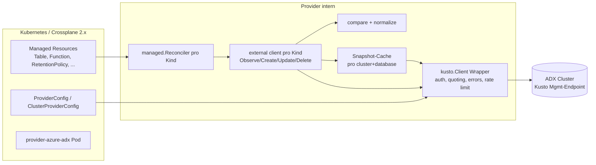

# provider-azure-adx – Technischer Implementierungsplan

Stand: 2026-09-07. Basis: `concept.md` (Entscheidungslog F1–F24). Dieser Plan übersetzt die Entscheidungen in Architektur, API-Design, Code-Struktur, Testaufbau und Meilensteine mit Akzeptanzkriterien.

Alle Aussagen zu Kusto-Commands, SDK-API und Template-Code sind gegen die aktuelle Doku bzw. den aktuellen Quellcode geprüft (Stand heute). Was nicht geprüft werden konnte, steht explizit unter „Spikes“ (Abschnitt 15) und muss in M0 verifiziert werden, bevor darauf gebaut wird.

> **Umsetzungsstand (2026-09-07):** M0–M3 sind implementiert (Client-Schicht, Table, Function, alle Tier-1-Policies, MaterializedView, ExternalTable, ContinuousExport, IngestionMapping, EntityGroup, SecurityRole, Tier-2-Cluster-Kinds), inklusive Unit-Tests, Emulator-Integrationstests, CI/E2E-Workflows und Doku. Abweichungen, die beim Bauen entstanden sind, stehen in [`implementation-notes.md`](implementation-notes.md); der Stand der Spikes in [`spikes.md`](spikes.md). Nicht gegen einen echten Cluster oder den Emulator ausgeführt wurde bisher nichts (Apple Silicon, A3) – das ist der nächste Schritt vor `v0.1.0`. **Hosting revidiert (2026-09-07, abends):** Repo `github.com/functional-team/provider-azure-adx`, Images `ghcr.io/functional-team/…`, API-Groups unter `functional.team` statt `crossplane.io` (Abschnitt 5.1 beschreibt den ursprünglichen contrib-Plan); S9 ist damit geschlossen.

---

## 0. Abweichungen zum concept.md (durch Verifikation entstanden)

| # | Abweichung | Grund |
|---|---|---|
| A1 | **`ClusterSecurityRole` entfällt** (war Tier 2). | Die Cluster-Rollen `AllDatabasesAdmin/Viewer/Monitor` sind laut Doku nicht per Management-Command konfigurierbar, nur über ARM/Portal. Damit ist das ARM-Terrain (F1). |
| A2 | **`.show tables details` ist nicht für Policy-Observe geeignet.** | Es liefert *effektive* Policies inkl. Vererbung. Eine Policy-MR muss aber wissen, ob die Policy *auf dieser Ebene* gesetzt ist. Batch-Observe für Policies läuft über `.show table * policy <name>` (Wildcard für `update` in der Doku belegt, für die anderen Policies Spike S3). |
| A3 | **Kusto-Emulator läuft nicht auf ARM.** | Doku: „ARM processors aren't supported“. Auf Apple Silicon (deine Maschine) läuft der Emulator nicht nativ. Integrationstests laufen in CI auf linux/amd64; lokal braucht es x86-Emulation oder einen echten Dev-Cluster. |
| A4 | **Testcontainers-Modul für Kusto gibt es nur für .NET.** | In Go nutzen wir `testcontainers-go` mit `GenericContainer`. Kein Mehraufwand, aber kein fertiges Modul. |
| A5 | **`view`-Flag einer Function ist in `.show functions` nicht enthalten.** | Spalten sind Name, Parameters, Body, Folder, DocString. Ob `.show database schema as json` das Flag liefert, ist Spike S5. Sonst wird `view` ein Write-only-Feld. |
| A6 | **Kusto formatiert Function-Bodies um.** | Doku-Beispiel: `{ StormEvents | take myLimit}` wird als `{ StormEvents | take myLimit }` zurückgegeben. P1 ist damit belegt, nicht nur vermutet. Die Hash-Fallback-Strategie (Abschnitt 8) ist Pflicht ab M1, nicht optional. |
| A7 | **`.create-or-alter external table` mit Managed Identity braucht `AllDatabasesAdmin`.** | Laut Doku. Der Provider-Principal braucht für den MI-Pfad bei External Tables Cluster-Rechte, nicht nur Database Admin. Muss in die Doku der ProviderConfig. |

---

## 1. Ziel und Rahmen

**Was gebaut wird:** Ein Crossplane-Provider (v2, namespaced MRs), der Artefakte *hinter dem Kusto-Endpoint* eines Azure-Data-Explorer-Clusters deklarativ verwaltet: Tabellen, Functions, Materialized Views, External Tables, Continuous Exports, Ingestion Mappings, Policies, Security Roles und später Cluster-Policies.

**Was nicht gebaut wird:** ARM-Ressourcen (Cluster, Database, Data Connections, Principal Assignments, Scripts), Datenbewegung (`.ingest`, `.set-or-append`), Ad-hoc-Queries, Fabric-spezifische Features.

**Nicht-funktionale Leitplanken (aus F18/F19):** 500–5.000 MRs pro Cluster, Poll-Default 10 Minuten, Batch-Observe pro Database, harte Guardrails gegen Datenverlust, keine Secrets im Status.

---

## 2. Architektur-Überblick



**Datenfluss pro Reconcile:**
1. Reconciler lädt MR, löst `providerConfigRef` (namespaced `ProviderConfig` oder `ClusterProviderConfig`), holt aus dem Client-Pool den `kusto.Client` für diese PC.
2. `Observe` fragt den Snapshot-Cache nach dem Abschnitt (z. B. „functions“ der Database X). Cache-Miss → ein Batch-`.show` füllt den Abschnitt für alle Entitäten dieser Database.
3. `compare` normalisiert Soll (Spec) und Ist (Snapshot) und entscheidet `ResourceExists` / `ResourceUpToDate`.
4. `Create`/`Update`/`Delete` bauen Commands über den sicheren Builder, führen sie aus, invalidieren den betroffenen Cache-Abschnitt.
5. Fehler laufen durch die zentrale Klassifikation (NotFound, AlreadyExists, Throttled, Transient, Auth, Permanent).

---

## 3. Repository-Layout

Ausgangspunkt: `crossplane/provider-template` (Stand heute: crossplane-runtime/v2 v2.4.0, controller-runtime v0.23.1, k8s v0.35, Go 1.25, golangci-lint 2.12). Umbenennen via `make provider.prepare provider=AzureADX`.

```
provider-azure-adx/
├── apis/
│   ├── v1alpha1/                    # ProviderConfig, ClusterProviderConfig, ProviderConfigUsage
│   ├── adx/v1alpha1/                # Entitäten: Table, Function, MaterializedView, ExternalTable,
│   │                                #   ContinuousExport, IngestionMapping
│   ├── policy/v1alpha1/             # RetentionPolicy, CachingPolicy, UpdatePolicy, ...
│   ├── security/v1alpha1/           # SecurityRole
│   ├── cluster/v1alpha1/            # Tier 2: WorkloadGroup, RequestClassificationPolicy, ...
│   ├── common/                      # EntityReference, Timespan, Principal, gemeinsame Typen
│   └── generate.go                  # controller-gen + angryjet
├── cmd/provider/main.go             # Flags, Manager, Controller-Setup (SetupGated)
├── internal/
│   ├── clients/
│   │   └── kusto/
│   │       ├── client.go            # Interface + azkustodata-Adapter, Client-Pool pro PC
│   │       ├── auth.go              # PC-Credentials → ConnectionStringBuilder
│   │       ├── cmd/                 # Command-Builder: Quoting, Literale, Policy-JSON
│   │       ├── kerrors/             # Fehlerklassifikation
│   │       ├── ratelimit.go         # Limiter + Semaphore pro Cluster
│   │       └── snapshot/            # Batch-Observe-Cache pro (cluster, database)
│   ├── adx/                         # Pure Domain-Logik pro Kind: build commands, parse .show, compare
│   │   ├── table/ function/ materializedview/ externaltable/ continuousexport/ mapping/
│   │   ├── policy/<name>/
│   │   └── security/
│   ├── controller/                  # Crossplane external clients pro Kind (dünn, delegiert an internal/adx)
│   │   ├── config/                  # ProviderConfig-Controller (Usage-Tracking)
│   │   ├── table/ function/ ...
│   │   └── register.go
│   ├── normalize/                   # KQL-Text-Normalisierung, Parameter-Parser, Timespan, Principals
│   └── features/
├── package/
│   ├── crds/                        # generiert
│   └── crossplane.yaml
├── examples/<group>/<kind>.yaml     # Pflicht pro Kind (make reviewable)
├── test/
│   ├── emulator/                    # testcontainers-go Setup, DB-Bootstrap
│   ├── integration/                 # Tests gegen Emulator (build tag `integration`)
│   └── e2e/                         # uptest-Manifeste + Workflow-Skripte gegen echten Cluster
├── docs/
├── build/                           # git submodule crossplane/build
├── .github/workflows/               # ci.yml, e2e.yml, release.yml
├── Makefile, go.mod, LICENSE (Apache-2.0), DCO, CODE_OF_CONDUCT.md, OWNERS.md, renovate.json
```

**Trennung, die zählt:** `internal/adx/<kind>` enthält *keine* Kubernetes-Abhängigkeiten. Dort liegen `BuildCreate(spec) Command`, `Parse(rows) Observed`, `Diff(desired, observed) Plan`. Das ist der Teil mit den harten Problemen (P1, P2) und muss ohne Cluster und ohne K8s unit-testbar sein. `internal/controller/<kind>` ist dünner Klebstoff.

---

## 4. Technologie-Stack (Pins)

| Komponente | Version / Modul | Anmerkung |
|---|---|---|
| Go | 1.25 | wie Template |
| crossplane-runtime | `github.com/crossplane/crossplane-runtime/v2` v2.4.x | `resource.ModernManaged`, `managed.WithTypedExternalConnector` |
| crossplane APIs | `github.com/crossplane/crossplane/apis/v2` | `xpv2.CredentialsSource`, `ProviderConfigStatus` |
| controller-runtime | v0.23.x | |
| Kusto SDK | `github.com/Azure/azure-kusto-go/azkustodata` v1.x | `azkustodata.New(kcsb)`, `client.Mgmt(ctx, db, stmt)` |
| Azure Identity | `github.com/Azure/azure-sdk-for-go/sdk/azidentity`, `azcore` | für `WithTokenCredential`, Sovereign Clouds über `cloud.Configuration` |
| Codegen | controller-gen, crossplane-tools (angryjet) | Refs/Selectors, DeepCopy, CRDs |
| Tests | `testcontainers-go`, `go-cmp`, `uptest` | Emulator-Image `mcr.microsoft.com/azuredataexplorer/kustainer-linux:latest` |
| Build/Release | `crossplane/build` Submodule, GitHub Actions, Renovate | xpkg → `ghcr.io/fakieheelflip/provider-azure-adx` |
| Mindest-Crossplane | 2.0 | namespaced MRs, `ClusterProviderConfig` |

**SDK-Fakten, die das Design bestimmen (verifiziert im Quellcode):**
- `client.Mgmt(ctx, db string, kqlQuery Statement, opts...)` – `Statement` ist ein Interface (`String()`, `GetParameters()`, `SupportsInlineParameters()`). Unser eigener Command-Typ implementiert es. `kql.New()` akzeptiert nur Compile-Time-Konstanten, ist für dynamische Commands ungeeignet.
- Auth-Builder: `WithAadAppKey(appId, key, tenant)`, `WithKubernetesWorkloadIdentity(appId, tokenFile, tenant)`, `WithSystemManagedIdentity()`, `WithUserAssignedIdentityClientId(id)`, `WithUserAssignedIdentityResourceId(id)`, `WithTokenCredential(azcore.TokenCredential)`, `AttachPolicyClientOptions(*azcore.ClientOptions)` (Sovereign Cloud).
- Fehler: `errors.GetKustoError(err)`, `*errors.HttpError` mit `IsThrottled()` und `UnmarshalREST()` (liefert das Kusto-REST-Fehlerobjekt inkl. `error.code` und `@permanent`), `errors.Retry(err)`, `Kind` (KTimeout, KHTTPError, KDBNotExist …).
- Row-Zugriff: `row.StringByName`, `row.DynamicByName` (JSON-Bytes), `row.BoolByName`, `row.TimespanByName`, `row.ToStruct`.

---

## 5. API-Design

### 5.1 Gruppen, Versionen, Naming

- **Hosting (entschieden 2026-09-07):** Das Repository startet unter dem persönlichen GitHub-Account `github.com/FakieHeelflip/provider-azure-adx` und wird nach Aufnahme per GitHub-Transfer nach `crossplane-contrib` verschoben. GitHub leitet die alte URL nach dem Transfer weiter (Clones, Issues, Stars bleiben); nur der Go-Modulpfad in `go.mod` und den Imports muss umgestellt werden. Container-Images liegen bis dahin unter `ghcr.io/fakieheelflip/provider-azure-adx` (ghcr verlangt Kleinschreibung); nach dem Transfer publiziert contrib nach `xpkg.crossplane.io/crossplane-contrib`, die alten ghcr-Tags bleiben als Archiv stehen. DCO-Sign-off erfolgt mit der E-Mail des Account-Inhabers; sollte später Firmenzeit einfließen, ist vor der Spende an contrib die Eigentumsfrage zu klären.
- Provider-Name: `provider-azure-adx`. Go-Modul zunächst `github.com/FakieHeelflip/provider-azure-adx`, nach contrib-Aufnahme `github.com/crossplane-contrib/provider-azure-adx` (Modulpfad-Wechsel ist Find/Replace, kein API-Bruch).
- API-Groups (alle `v1alpha1`, ab M2-Abschluss `v1beta1` für Tier 1):
  - `adx.azure.crossplane.io` – ProviderConfig-Typen und Entitäten
  - `policy.adx.azure.crossplane.io` – alle `*Policy`-Kinds
  - `security.adx.azure.crossplane.io` – `SecurityRole`
  - `cluster.adx.azure.crossplane.io` – Tier 2
- **Kein `.m.`-Infix.** provider-kubernetes/helm nutzen `kubernetes.m.crossplane.io` nur, weil die Legacy-Group cluster-scoped bleibt. Das aktuelle provider-template legt namespaced Kinds ohne Infix an (`sample.template.crossplane.io`, `scope: Namespaced`). Ein v2-only-Provider hat keinen Konflikt. Beim contrib-Antrag explizit bestätigen lassen (Spike S9).
- Alle MRs: `+kubebuilder:resource:scope=Namespaced,categories={crossplane,managed,adx}`, implementieren `resource.ModernManaged`.
- Externer Name: `crossplane.io/external-name`-Annotation ist Source of Truth. Optionales `spec.forProvider.name`; ein eigener `Initializer` schreibt es in die Annotation, wenn diese leer ist. Reihenfolge: eigener Initializer vor `managed.NameAsExternalName`. Beide Felder sind nach dem ersten Reconcile unveränderlich (CEL: `self == oldSelf` auf `name`; Annotation-Änderung = neue externe Ressource, Doku warnt).

### 5.2 ProviderConfig / ClusterProviderConfig

Gleiches Spec für beide Kinds (Template-Muster: `ProviderConfigSpec` geteilt, `ProviderConfig` namespaced, `ClusterProviderConfig` cluster-scoped).

```yaml
apiVersion: adx.azure.crossplane.io/v1alpha1
kind: ProviderConfig
metadata:
  name: telemetry-prod
  namespace: data-platform
spec:
  clusterUri: https://telemetry-prod.westeurope.kusto.windows.net   # required, immutable
  azureEnvironment: AzurePublicCloud   # AzurePublicCloud | AzureChinaCloud | AzureUSGovernment (F17)
  credentials:
    source: Secret                     # Secret | WorkloadIdentity | ManagedIdentity | None
    secretRef:                         # nur bei Secret
      namespace: data-platform
      name: adx-sp
      key: credentials                 # JSON {"clientId","clientSecret","tenantId"} – kompatibel zum Upbound-Azure-Secret
    workloadIdentity:                  # nur bei WorkloadIdentity; leer = aus AZURE_CLIENT_ID/AZURE_TENANT_ID/AZURE_FEDERATED_TOKEN_FILE
      clientId: ""
      tenantId: ""
    managedIdentity:                   # nur bei ManagedIdentity
      type: SystemAssigned             # SystemAssigned | UserAssigned
      clientId: ""                     # bei UserAssigned (alternativ resourceId)
      resourceId: ""
```

Regeln:
- `source: None` ist nur erlaubt, wenn `clusterUri` mit `http://` beginnt (Emulator). CEL-Regel im CRD.
- `source: Secret` nutzt den Standard-`CommonCredentialExtractor` aus crossplane-runtime. Die anderen Quellen sind eigene Werte und werden nicht durch den Extractor geführt.
- Mapping auf den SDK-Builder:

| source | Builder |
|---|---|
| Secret | `WithAadAppKey(clientId, clientSecret, tenantId)` |
| WorkloadIdentity | `WithKubernetesWorkloadIdentity(clientId, tokenFile, tenantId)` |
| ManagedIdentity/SystemAssigned | `WithSystemManagedIdentity()` |
| ManagedIdentity/UserAssigned | `WithUserAssignedIdentityClientId(...)` oder `...ResourceId(...)` |
| None | kein Auth-Builder (Emulator) |

- `azureEnvironment` → `azcore.ClientOptions{Cloud: cloud.AzureChina / AzureGovernment}` via `AttachPolicyClientOptions`. Ungetestet (F17), aber im Code vorhanden.
- Status: Standard `ProviderConfigStatus` (Users-Zähler). Kein Connectivity-Check im PC-Controller (KISS; Fehler zeigen sich an der ersten MR).

**Rechte des PC-Principals (Doku-Pflicht):** Database Admin pro Ziel-Database. `AllDatabasesAdmin` für Tier 2, für External Tables mit Managed Identity (A7) und für Managed-Identity-Policies.

### 5.3 Gemeinsame Bausteine (`apis/common`)

```go
// EntityReference adressiert das Ziel einer Policy oder Rolle.
type EntityReference struct {
    // +kubebuilder:validation:Enum=Database;Table;MaterializedView;ExternalTable;Function
    Kind string `json:"kind"`
    // Name der Entität. Leer bei Kind=Database.
    Name *string `json:"name,omitempty"`
    // Ref/Selector auf eine MR desselben Providers; der Zieltyp folgt aus Kind.
    NameRef      *xpv1.NamespacedReference `json:"nameRef,omitempty"`
    NameSelector *xpv1.NamespacedSelector  `json:"nameSelector,omitempty"`
}

// Timespan akzeptiert Kusto-Literale ("30d", "1h", "00:10:00") und .NET-Format ("30.00:00:00").
// Intern time.Duration; Serialisierung nach Kusto immer als "d.hh:mm:ss".
type Timespan string

// Principal ist ein Kusto-Principal-String, z. B. "aaduser=alice@contoso.com",
// "aadapp=<appId>;<tenantId>", "aadgroup=<name-or-objectId>;<tenantId>".
type Principal string
```

- Die Ref-Auflösung für `EntityReference` ist handgeschrieben (ein `ResolveReferences`, der anhand von `Kind` den Zieltyp wählt). angryjet-generierte Refs kommen für die einfachen Felder (`tableRef`, `externalTableRef`, `sourceTableRef`).
- Jede DB-scoped MR hat `spec.forProvider.database` (required, immutable per CEL). `Database` ist bewusst nur ein String (F10).
- Optionale Policy-Felder sind Pointer. Vergleich nur auf gesetzten Feldern (siehe 7.3). Keine Late-Initialization in den Spec.

### 5.4 Entitäten (Group `adx.azure.crossplane.io`)

#### Table

```yaml
apiVersion: adx.azure.crossplane.io/v1alpha1
kind: Table
metadata:
  name: raw-events
  namespace: telemetry
  annotations:
    crossplane.io/external-name: RawEvents
spec:
  forProvider:
    database: Telemetry
    columns:
      - name: Timestamp
        type: datetime
      - name: Payload
        type: dynamic
        docstring: "Raw JSON body"
    folder: Raw
    docstring: "Landing table"
    schemaUpdateMode: Merge          # Merge (default) | Replace
  providerConfigRef:
    name: telemetry-prod             # kind: ProviderConfig (default) | ClusterProviderConfig
```

| Operation | Command | Bemerkung |
|---|---|---|
| Observe (batch) | `.show database ['DB'] schema as json with (Tables=true)` | Spalten, Folder, DocString (Spike S4: prüfen, dass Folder/DocString/CslType enthalten sind) |
| Observe (single) | `.show table ['T'] cslschema` | Fallback / Cache aus |
| Create | `.create table ['T'] (['C1']:type, ...) with (folder=..., docstring=...)` | Race mit paralleler Erstellung → AlreadyExists → nächster Observe |
| Update Schema (Merge) | `.alter-merge table ['T'] (...)` | nur Hinzufügen; fehlende Spalten im Spec werden **ignoriert**, tauchen aber als Drift-Hinweis im Status auf |
| Update Schema (Replace) | `.alter table ['T'] (...)` | entfernt Spalten und deren Daten; nur bei `schemaUpdateMode: Replace` |
| Typänderung einer Spalte | – | immer Fehler: `Synced=False`, Meldung „column X type change int→long is not supported; recreate manually“ |
| Update Metadaten | `.alter table ['T'] docstring "..."`, `.alter table ['T'] folder "..."`, `.alter-merge table ['T'] column-docstrings (['C']:"...")` | getrennt vom Schema |
| Delete | `.drop table ['T'] ifexists` | Datenverlust, Crossplane-Standard-Delete (F8) |

Spaltentypen: Enum `bool, datetime, dynamic, guid, int, long, real, decimal, string, timespan`. Aliase (`boolean, date, uuid, uniqueid, double, time`) werden beim Vergleich auf die kanonische Form gemappt, weil `.show` kanonisch antwortet.

Status `atProvider`: `columns` (observiert), `folder`, `docstring`, `driftColumns` (Spalten, die im Cluster existieren, aber nicht im Spec – relevant bei Merge).

#### Function

```yaml
kind: Function
spec:
  forProvider:
    database: Telemetry
    parameters: "(limit:long = 100)"    # roher Parameter-String inkl. Klammern, default "()"
    body: |
      RawEvents
      | take limit
    folder: Parsing
    docstring: "..."
    view: false
    skipValidation: false
```

| Operation | Command |
|---|---|
| Observe (batch) | `.show functions` |
| Observe (single) | `.show function ['F']` |
| Create/Update | `.create-or-alter function with (docstring=..., folder=..., view=..., skipvalidation=...) ['F'](params) { body }` |
| Delete | `.drop function ['F'] ifexists` |

- Body wird ohne äußere Klammern im Spec geführt; der Builder ergänzt `{ }`.
- Vergleich von `parameters` und `body` läuft über die Normalisierung aus Abschnitt 8. `view` ist Write-only, bis Spike S5 klärt, ob es observierbar ist.

#### MaterializedView

```yaml
kind: MaterializedView
spec:
  forProvider:
    database: Telemetry
    sourceTable: RawEvents             # oder sourceTableRef/-Selector; alternativ sourceMaterializedView
    query: |
      RawEvents | summarize arg_max(Timestamp, *) by DeviceId
    backfill: true                     # create-only
    effectiveDateTime: "2026-01-01T00:00:00Z"   # create-only
    updateExtentsCreationTime: false   # create-only
    lookback: 6h
    lookbackColumn: Timestamp          # nach dem Setzen unveränderlich (Kusto-Regel)
    autoUpdateSchema: false
    dimensionTables: [DimDevices]
    folder: Views
    docstring: "..."
    allowMaterializedViewsWithoutRowLevelSecurity: false
    maxSourceRecordsForSingleIngest: 0 # create-only, backfill
    concurrency: 0                     # create-only, backfill
    enabled: true
```

| Operation | Command |
|---|---|
| Observe (batch) | `.show materialized-views` (Name, SourceTable, Query, IsEnabled, IsHealthy, Folder, DocString, AutoUpdateSchema, EffectiveDateTime, Lookback, LookbackColumn) |
| Create (backfill=false) | `.create ifnotexists materialized-view with (...) ['MV'] on table ['Src'] { query }` |
| Create (backfill=true) | `.create async ifnotexists materialized-view with (backfill=true, ...) ['MV'] on table ['Src'] { query }` → `OperationId` in `status.atProvider.operationId` |
| Observe während Backfill | `.show operations <OperationId>` → `State` ∈ {InProgress, Scheduled} → Exists=true, UpToDate=true, Condition `Creating`; `Completed` → operationId löschen; `Failed/BadInput/Throttled/Abandoned/Canceled/PartiallySucceeded` → operationId löschen, Fehler mit `Status`-Text in Condition, Backoff, Create wird erneut versucht |
| Update | `.alter materialized-view with (lookback=..., lookback_column=..., autoUpdateSchema=..., dimensionTables=..., folder=..., docString=...) ['MV'] on table ['Src'] { query }` – erlaubt für Query (mit Kusto-Limits: keine Änderung der group-by-Ausdrücke, keine Spaltentypen/-namen), Properties |
| Enable/Disable | `.enable materialized-view ['MV']` / `.disable materialized-view ['MV']` |
| Delete | `.drop materialized-view ['MV'] ifexists` |

- `sourceTable`/`sourceMaterializedView` immutable (CEL). Änderung = neue Ressource.
- Wenn `.alter` mit Kusto-Fehler scheitert (z. B. group-by geändert), bleibt `Synced=False` mit der Kusto-Meldung. Kein Auto-Recreate (F8).
- `.show operations <id>` liefert nur Einträge < 6 h; Backfill über 6 h ohne Statuswechsel → Fallback auf `.show operations | where OperationId == ...` (historische Log-Form). Beides implementieren.

#### ExternalTable (Storage, Delta)

```yaml
kind: ExternalTable
spec:
  forProvider:
    database: Telemetry
    kind: Storage                      # Storage | Delta (SQL/Cosmos später)
    columns: [...]                     # bei Delta optional (Schema-Inferenz)
    partitionBy: "Date:datetime = bin(Timestamp, 1d)"      # roher Kusto-Ausdruck
    pathFormat: "datetime_pattern(\"yyyy/MM/dd\", Date)"   # roher Kusto-Ausdruck
    dataFormat: parquet
    connectionStrings:
      - value: "https://acct.blob.core.windows.net/exports;managed_identity=system"   # ohne Secret
      - secretKeyRef: {name: storage-sas, key: connectionString}                   # mit Secret
    properties:
      folder: External
      docString: "..."
      compressed: true
      compressionType: snappy
      includeHeaders: None
      namePrefix: ""
      fileExtension: ".parquet"
      encoding: UTF8NoBOM
```

| Operation | Command |
|---|---|
| Observe (batch) | `.show external tables` → TableName, TableType, Folder, DocString, Properties (JSON), ConnectionStrings (Secrets maskiert `;*******`), Partitions (JSON), PathFormat |
| Observe Schema | `.show external table ['E'] cslschema` (per Entität; nur wenn Spec `columns` hat) |
| Create/Update | `.create-or-alter external table ['E'] (schema) kind=storage partition by (...) pathformat=(...) dataformat=... (h@'cs1', h@'cs2') with (...)` – idempotent |
| Delete | `.drop external table ['E']` |

- Connection Strings werden **immer** als obfuskierte Literale `h@'...'` gesendet (F13). Vergleich: Anzahl und URI-Teil vor dem ersten `;` (der ist in `.show` sichtbar). Der Secret-Teil ist Write-only; Änderung eines Secrets wird über den Hash-Mechanismus (Abschnitt 8) erkannt: Hash des aufgelösten Strings in Annotation, Abweichung → Update.
- `partitionBy`/`pathFormat`: `.show` liefert Partitions als JSON-Objekte, nicht als Kusto-Text. Vergleich über Hash-Fallback (Abschnitt 8), nicht durch Rückübersetzung.

#### ContinuousExport

```yaml
kind: ContinuousExport
spec:
  forProvider:
    database: Telemetry
    externalTable: ExportsParquet      # + externalTableRef/-Selector
    overTables: [RawEvents]            # optional; + overTableRefs
    query: |
      RawEvents | where Level == "Error"
    intervalBetweenRuns: 1h
    forcedLatency: 10m
    sizeLimit: 104857600
    distributed: true
    distribution: per_node
    distributionKind: default
    parquetRowGroupSize: 100000
    managedIdentity: system            # "system" oder Object-ID
    enabled: true
```

| Operation | Command |
|---|---|
| Observe (batch) | `.show continuous-exports` → Name, ExternalTableName, Query, ForcedLatency, IntervalBetweenRuns, CursorScopedTables (`["['DB'].['T']"]`), ExportProperties (JSON), IsDisabled, LastRunResult, ExportedTo, IsRunning |
| Create/Update | `.create-or-alter continuous-export ['CE'] over (['T1']) to table ['E'] with (intervalBetweenRuns=1h, ...) <| query` |
| Enable/Disable | `.enable continuous-export ['CE']` / `.disable continuous-export ['CE']` |
| Delete | `.drop continuous-export ['CE']` |

- `overTables` wird für den Vergleich in die Kusto-Ausgabeform `['DB'].['T']` normalisiert.
- Query-Vergleich über Abschnitt 8.

#### IngestionMapping

```yaml
kind: IngestionMapping
spec:
  forProvider:
    database: Telemetry
    table: RawEvents                   # + tableRef
    kind: json                         # csv | json | avro | parquet | orc | w3clogfile
    mapping:
      - column: Timestamp
        dataType: datetime
        properties: {path: "$.ts"}
      - column: Payload
        properties: {path: "$"}
```

| Operation | Command |
|---|---|
| Observe | `.show table ['T'] ingestion mappings` (per Tabelle, alle Kinds; kein DB-weiter Batch für Tabellen-Mappings) |
| Create/Update | `.create-or-alter table ['T'] ingestion json mapping "Name" '[...]'` |
| Delete | `.drop table ['T'] ingestion json mapping "Name"` |

- external-name = Mapping-Name; die Identität ist `(database, table, kind, name)`.
- Mapping-JSON wird typisiert roundgetrippt (Kusto ergänzt Felder wie `CsvDataType: null`). Vergleich nur auf gesetzten Feldern.

### 5.5 Policies (Group `policy.adx.azure.crossplane.io`)

Ein Kind pro Policy-Typ (F6). Gemeinsames Muster:

```yaml
apiVersion: policy.adx.azure.crossplane.io/v1alpha1
kind: RetentionPolicy
spec:
  forProvider:
    database: Telemetry
    entity:
      kind: Table                      # erlaubte Kinds per Policy-Typ via CEL
      name: RawEvents                  # oder nameRef/nameSelector
    softDeletePeriod: 365d
    recoverability: Enabled
```

Generische Command-Form (alle Policies unterstützen die JSON-Form):

| Operation | Command |
|---|---|
| Observe (batch) | `.show table * policy <policy>` → PolicyName, EntityName (`[DB].[T]`), Policy (JSON oder `null`), ChildEntities, EntityType (Spike S3 für alle Policy-Typen außer `update`) |
| Observe (Database) | `.show database ['DB'] policy <policy>` |
| Observe (single) | `.show table ['T'] policy <policy>` |
| Create/Update | `.alter table ['T'] policy <policy> @'<json>'` (bzw. `.alter database ['DB'] policy ...`, `.alter materialized-view ['MV'] policy ...`) |
| Delete | `.delete table ['T'] policy <policy>` → zurück auf Vererbung |

- **Semantik von „existiert“:** Policy-JSON auf dieser Ebene ≠ `null`. Eine geerbte Policy zählt nicht als existent.
- **Vergleich:** Observiertes JSON in den typisierten Struct parsen, nur gesetzte Spec-Felder vergleichen (Kusto ergänzt Defaults wie `ContainerRecyclingPeriod`).
- **Timespans:** Spec akzeptiert Kusto-Literale, Vergleich als `time.Duration`.

Policy-Kinds Tier 1 und ihre erlaubten Ziele:

| Kind | Ziele | Kernfelder (Kusto-JSON) |
|---|---|---|
| RetentionPolicy | Table, MaterializedView, Database | SoftDeletePeriod, Recoverability |
| CachingPolicy | Table, MaterializedView, Database | DataHotSpan/IndexHotSpan (Spec: `hot`), HotWindows[] |
| UpdatePolicy | Table | Array: IsEnabled, Source, Query, IsTransactional, PropagateIngestionProperties, ManagedIdentity |
| RowLevelSecurityPolicy | Table, MaterializedView | IsEnabled, Query (Command: `.alter table T policy row_level_security enable "Q"`) |
| IngestionBatchingPolicy | Table, Database | MaximumBatchingTimeSpan, MaximumNumberOfItems, MaximumRawDataSizeMB |
| StreamingIngestionPolicy | Table, Database | IsEnabled, HintAllocatedRate |
| MergePolicy | Table, MaterializedView, Database | RowCountUpperBoundForMerge, OriginalSizeMBUpperBoundForMerge, MaxExtentsToMerge, LoopPeriod, MaxRangeInHours, AllowRebuild, AllowMerge, Lookback |
| ShardingPolicy | Table, MaterializedView, Database | MaxRowCount, MaxExtentSizeInMb, MaxOriginalSizeInMb, ShardEngineMaxRowCount, ShardEngineMaxExtentSizeInMb, ShardEngineMaxOriginalSizeInMb |
| PartitioningPolicy | Table, MaterializedView | PartitionKeys[], EffectiveDateTime |
| IngestionTimePolicy | Table | IsEnabled (`.alter table T policy ingestiontime true`) |
| AutoDeletePolicy | Table | ExpiryDate, DeleteIfNotEmpty |
| RestrictedViewAccessPolicy | Table | IsEnabled |
| ExtentTagsRetentionPolicy | Table, Database | Array: TagPrefix, RetentionPeriod |
| EncodingPolicy | Table, Database, Column (`entity.kind: Column` + `column`) | Type, ColumnEncodingProfile … (`.alter column ['T'].['C'] policy encoding`) |
| ManagedIdentityPolicy | Database | Array: ObjectId, AllowedUsages[] (`.alter database D policy managed_identity @'[...]'`) |

Tier 2 (Group `cluster.adx.azure.crossplane.io`, Cluster-Ziel, kein `entity`): WorkloadGroup (`.create-or-alter workload_group`), RequestClassificationPolicy (`.alter cluster policy request_classification @'{...}' <| query`), CalloutPolicy, CapacityPolicy, SandboxPolicy, QueryWeakConsistencyPolicy, ClusterManagedIdentityPolicy, MultiDatabaseAdminsPolicy. Observe über `.show cluster policy <name>` bzw. `.show workload_groups`. Da es pro Cluster genau eine Instanz gibt, ist der externe Name fest (z. B. `cluster`); zwei MRs auf dieselbe Cluster-Policy sind ein Nutzerfehler und werden im Status gemeldet (Spike S8, ob wir das erkennen können).

### 5.6 SecurityRole (Group `security.adx.azure.crossplane.io`)

```yaml
kind: SecurityRole
spec:
  forProvider:
    database: Telemetry
    entity: {kind: Table, name: RawEvents}     # Database | Table | ExternalTable | MaterializedView | Function
    role: ingestors                            # admins | users | viewers | unrestrictedviewers | ingestors | monitors
    mode: Authoritative                        # Authoritative (default) | Additive
    principals:
      - "aadapp=4c7e82bd-6adb-46c3-b413-fdd44834c69b;72f988bf-86f1-41af-91ab-2d7cd011db47"
      - "aadgroup=data-ingest;contoso.com"
    description: "managed by crossplane"
```

Gültige Kombinationen (CEL): Database → alle sechs Rollen; Table → admins, ingestors; ExternalTable, MaterializedView, Function → admins.

| Operation | Command |
|---|---|
| Observe | `.show table ['T'] principals` (bzw. database/external table/materialized-view/function), gefiltert auf die Rolle |
| Authoritative | `.set table ['T'] ingestors ('p1', 'p2') skip-results 'description'`; leere Liste → `.set ... none` |
| Additive | `.add table ['T'] ingestors (...)` für fehlende, `.drop ... (...)` für eigene entfernte Principals |
| Delete | Authoritative → `.set ... none`; Additive → `.drop` der eigenen Principals |

**Principal-Normalisierung (Kernproblem):** `.show ... principals` liefert `PrincipalType`, `PrincipalDisplayName`, `PrincipalObjectId`, `PrincipalFQN`. Die FQN entspricht selten dem, was der Nutzer schreibt (UPN vs. Object-ID, App-ID vs. Object-ID). Lösung ohne Graph-API:

1. Nach jedem `.add`/`.set` liefert Kusto die aktualisierte Principal-Liste zurück. Der Provider ordnet jeden Spec-Eintrag einem `PrincipalObjectId` zu (Diff vorher/nachher bzw. Match auf FQN/DisplayName/Object-ID) und persistiert die Zuordnung in `status.atProvider.resolvedPrincipals: [{spec, objectId, fqn, displayName}]`.
2. `Observe` vergleicht Mengen von Object-IDs: Soll = aufgelöste Object-IDs aller Spec-Einträge; Ist = Object-IDs der Rolle aus `.show`. Nicht aufgelöste Spec-Einträge → nicht up to date → Write, dann auflösen.
3. Entfernte Spec-Einträge werden über ihre gespeicherte FQN/Object-ID gedroppt.

Damit ist der Vergleich robust gegen die Darstellungsform. Kosten: eine zusätzliche Roundtrip-Auswertung nach jedem Write. Spike S6 klärt die exakte Ausgabeform der Rollennamen (z. B. „Table RawEvents Ingestor“).

### 5.7 Status und Conditions

- `status.atProvider` minimal (F15): observierte Kernfelder, `operationId` (MV), `resolvedPrincipals` (SecurityRole), `driftColumns` (Table).
- Conditions: Standard `Ready`/`Synced`. Zusätzlich Reason-Codes im `Synced`-Condition-Message für die Guardrails: `UnsupportedColumnTypeChange`, `ColumnsMissingInSpec` (nur Hinweis, bleibt Synced=True), `MaterializedViewAlterRejected`, `Throttled`.
- Events über `event.NewAPIRecorder` (Template-Standard).

---

## 6. Kusto-Client-Schicht (`internal/clients/kusto`)

### 6.1 Interface und Pool

```go
type Client interface {
    // Mgmt führt ein Management-Command gegen eine Database aus ("" für Cluster-Ebene).
    Mgmt(ctx context.Context, database string, c cmd.Command) (Result, error)
    Endpoint() string
}

type Result interface {
    Rows() []Row       // Primary Result
    Tables() []Table   // alle Tabellen (für .show operations, .add principals)
}

// Pool hält einen Client pro ProviderConfig (Key: Kind/Namespace/Name + resourceVersion der PC
// + Hash der Credentials). Idle-Eviction nach 30 min. Disconnect ist no-op.
```

- Ein `azkustodata.Client` hält HTTP-Verbindungen und Token-Cache; pro Reconcile neu zu bauen wäre teuer und würde Token-Endpunkte belasten. Daher Pool.
- Emulator: `NewConnectionStringBuilder("http://host:port")` ohne Auth. Spike S1 prüft, ob das SDK `http://`-Endpunkte akzeptiert (Paket `trusted_endpoints`) oder eine Freigabe braucht.

### 6.2 Command-Builder (`cmd`)

Grundregel: **Kein String-Concat mit Nutzereingaben außerhalb dieses Pakets.**

```go
type Command struct{ text string } // implementiert azkustodata.Statement

func Ident(name string) string      // ['name'] mit Escaping von ' und \
func Str(s string) string           // "..." mit Kusto-Escaping
func Obfuscated(s string) string    // h@'...' (nur für Connection Strings / Secrets)
func TimespanLit(d time.Duration)   // 1.02:03:04
func JSONLit(v any) string          // @'...' mit Escaping, serialisiert über encoding/json
func Body(kql string) string        // { ... } – Klammern ergänzen, keine weitere Manipulation
```

- Entitätsnamen werden immer als `['...']` gerendert, auch wenn sie „einfach“ sind. `.show`-Ausgaben liefern Namen unquoted; der Vergleich läuft auf dem rohen Namen.
- Policies werden aus typisierten Structs über `encoding/json` serialisiert und als `@'...'` übergeben.
- Query-Bodies (`<|`- oder `{ }`-Form) werden nicht verändert. KQL-Injection über einen Body ist per Definition nicht verhinderbar (der Body *ist* Code); das Risiko liegt beim Autor der MR und wird per RBAC auf die MR-Kinds begrenzt. Doku-Punkt.
- Golden-File-Tests pro Builder.

### 6.3 Fehlerklassifikation (`kerrors`)

```go
type Class int
const (
    Unknown Class = iota
    NotFound        // BadRequest_EntityNotFound, KDBNotExist
    AlreadyExists   // Entity already exists (Code Spike S2)
    Throttled       // HttpError.IsThrottled() / 429 / "throttled"
    Transient       // errors.Retry(err) == true, KTimeout, KIO, 5xx
    Unauthorized    // 401/403
    Permanent       // @permanent == true, sonstige 400
)
func Classify(err error) Class
```

Quellen: `errors.GetKustoError`, `*errors.HttpError.UnmarshalREST()["error"]["code"]`, `@permanent`, HTTP-Status. Textuelle Fallbacks nur als letzte Stufe und mit Test-Fixtures belegt.

Reconciler-Verhalten:
- `NotFound` bei Observe → `ResourceExists: false`.
- `AlreadyExists` bei Create → kein Fehler, Requeue (Observe sieht die Entität).
- `Throttled`/`Transient` → Fehler zurück, crossplane-runtime macht Backoff. Zusätzlich Metrik `adx_commands_throttled_total`.
- `Unauthorized`/`Permanent` → Fehler mit Kusto-Message in Condition; kein Sonder-Handling.

### 6.4 Rate Limiting pro Cluster

- `golang.org/x/time/rate` Limiter pro Client (Flag `--kusto-commands-per-second`, Default 5) und Semaphore für gleichzeitige Commands (Flag `--kusto-max-inflight`, Default 4).
- Global: `--max-reconcile-rate` (Template, Default 10) und `--poll` (Default **10m**, Template-Default 1m wird überschrieben).
- Metriken: Commands pro Klasse, Dauer, Cache-Hits/Misses, Throttles. Standard-Managed-Resource-Metriken vom Template.

### 6.5 Snapshot-Cache (Batch-Observe)

Zweck: Bei 5.000 MRs und 10-Minuten-Poll sind das ohne Batching ~8 Commands/s Dauerlast. Mit Batching pro Database und Abschnitt sinkt das auf `Databases × Abschnitte / TTL`.

```go
type Section string // "tables", "functions", "materializedviews", "externaltables",
                    // "continuousexports", "policy:retention", "policy:update", ..., "dbpolicy:retention"

type Snapshot interface {
    Tables(ctx, db) (map[string]TableInfo, error)
    Functions(ctx, db) (map[string]FunctionInfo, error)
    TablePolicies(ctx, db, policy string) (map[string]json.RawMessage, error) // Name → Policy-JSON oder nil
    ...
    Invalidate(db string, sections ...Section)
}
```

- Key: `(clusterUri, database, section)`. TTL per Flag `--observe-cache-ttl` (Default 60s). `--disable-observe-cache` schaltet auf Einzel-`.show` um.
- Loader: `.show database ['DB'] schema as json with (Tables=true, Functions=true, MaterializedViews=true, ExternalTables=true)` füllt vier Abschnitte in einem Command. `.show materialized-views`, `.show external tables`, `.show continuous-exports` liefern die Zusatzfelder (IsEnabled, Properties …). `.show table * policy <p>` pro Policy-Typ. `.show database ['DB'] policy <p>` für Database-Policies.
- `singleflight` pro Key, damit 200 gleichzeitige Reconciles einer Database einen Load auslösen, nicht 200.
- **Invalidierung:** Jeder Create/Update/Delete invalidiert den betroffenen Abschnitt seiner Database. Der eigene Folge-Observe sieht damit frische Daten. Externe Drift wird spätestens nach TTL gesehen, das ist gegen 10-Minuten-Poll vernachlässigbar.
- Management-Commands sind stark konsistent (Admin-Node), keine Eventual-Consistency-Sorgen zwischen Write und Re-Read.
- Nicht gebatcht (per Entität): IngestionMapping (`.show table T ingestion mappings`), SecurityRole (`.show <entity> principals`), External-Table-Schema (`cslschema`). Begründung: kein DB-weiter Command verfügbar; Mengen sind kleiner.
- Provider-Neustart: Alle MRs reconcilen gleichzeitig → der Cache ist hier am wirksamsten (ein Load pro Abschnitt statt Tausende Einzel-`.show`).

---

## 7. Reconcile-Muster

### 7.1 Vertrag pro Kind

```
Observe:
  name := external-name
  obs, ok := snapshot.<Section>(db)[name]      // oder Einzel-.show bei Cache aus
  if !ok → {ResourceExists:false}
  plan := adx.<kind>.Diff(spec, obs)           // reine Funktion
  if plan.Blocked → Condition mit Reason, {Exists:true, UpToDate:true}   // z. B. Typänderung: nicht endlos Update versuchen
  return {Exists:true, UpToDate: plan.Empty(), ResourceLateInitialized:false}

Create:  cmds := adx.<kind>.BuildCreate(spec); run; invalidate; return
Update:  cmds := adx.<kind>.BuildUpdate(plan); run; invalidate; return
Delete:  cmds := adx.<kind>.BuildDelete(spec); run; invalidate; NotFound ist kein Fehler
```

- `Diff` liefert einen Plan aus Schritten (z. B. `AlterMergeSchema`, `SetDocstring`, `SetFolder`), damit Update nur die nötigen Commands schickt und Tests den Plan prüfen können.
- `Blocked`-Pläne (Guardrails) setzen `Synced=False` mit Reason, geben aber `UpToDate: true` zurück, sonst würde der Reconciler jedes Mal `Update` aufrufen. Der Zustand ist sichtbar, nicht laut.

### 7.2 Initializer und externer Name

Reihenfolge der Initializer: `SpecNameAsExternalName` (eigen) → `managed.NameAsExternalName` (Standard). Ergebnis: Annotation gesetzt aus `spec.forProvider.name`, sonst `metadata.name`.

### 7.3 Vergleichsregeln

- Nur gesetzte Spec-Felder werden verglichen (Pointer-Semantik). Server-Defaults erzeugen keine Drift.
- Strings: exakt, nach Trim.
- KQL-Text und Kusto-formatierte Ausdrücke: Abschnitt 8.
- Timespans: als Duration.
- Listen mit Identität (Spalten, Update-Policies): Reihenfolge ist bei Spalten relevant (`.alter-merge` hängt an; `.alter` ordnet neu) → bei `Merge` Reihenfolge ignorieren, bei `Replace` berücksichtigen.

### 7.4 Async-Operationen

Nur MaterializedView (Backfill). Muster: `operationId` im Status, Observe pollt, Conditions spiegeln `Creating`. Kein Timeout im Provider; Kusto beendet die Operation selbst (Completed/Failed/Abandoned).

### 7.5 Import bestehender Artefakte

`crossplane.io/external-name` setzen, `managementPolicies: [Observe]` → Observe liest, kein Write. Danach Policies erweitern. Kein Bulk-Import-Tooling (YAGNI).

---

## 8. Drift-Normalisierung von KQL-Text (P1)

Betroffene Felder: Function `parameters`/`body`, UpdatePolicy `query`, RowLevelSecurity `query`, MaterializedView `query`, ContinuousExport `query`, ExternalTable `partitionBy`/`pathFormat`, `overTables`.

**Stufe 1 – deterministische Normalisierung (beide Seiten):**
- CRLF → LF, Trailing Whitespace pro Zeile entfernen, führende/abschließende Leerzeilen entfernen.
- Function-Body: äußere `{ }` entfernen, dann wie oben.
- Parameter-Liste: eigener Tokenizer, der Whitespace außerhalb von String-Literalen entfernt und Typ-Aliase kanonisiert (`(a:string, b:int = 5)` ≡ `(a:string,b:int=5)`). Tabulare Parameter (`T:(x:long)`) und `*` werden als Tokens durchgereicht.
- `overTables`: in `['DB'].['T']` rendern.
- **Kein** Kollabieren von Whitespace innerhalb von Zeilen (Whitespace in String-Literalen ist semantisch).

**Stufe 2 – Echo-Toleranz per Hash (Pflicht, weil Kusto umformatiert, siehe A6):**
- Nach jedem erfolgreichen Write liest der Provider die Entität zurück und speichert zwei Annotationen:
  - `adx.azure.crossplane.io/applied-hash`: Hash der normalisierten *Soll*-Texte, die geschrieben wurden.
  - `adx.azure.crossplane.io/observed-hash`: Hash der normalisierten *Ist*-Texte direkt nach dem Write.
- Observe gilt als up to date, wenn entweder Stufe 1 Gleichheit ergibt **oder** (`hash(soll) == applied-hash` und `hash(ist) == observed-hash`). Ändert jemand im Cluster den Body, ändert sich `hash(ist)` → Drift erkannt. Ändert der Nutzer den Spec, ändert sich `hash(soll)` → Update.
- Damit ist die Endlosschleife ausgeschlossen, ohne Drift-Erkennung zu opfern. Kosten: ein zusätzlicher Read nach jedem Write (bei Batch-Observe ohnehin nötig für die Invalidierung).

**Abbruchkriterium aus concept.md:** Wenn Stufe 2 in M1 gegen den Emulator nicht stabil ist (z. B. weil Kusto Bodies nicht deterministisch zurückgibt), wird Stufe 2 zur einzigen Quelle und Stufe 1 entfällt. Das ist dann eine bewusste Entscheidung mit Doku-Eintrag.

---

## 9. Destruktive Änderungen (P2)

| Fall | Verhalten | Reason |
|---|---|---|
| Spalte im Spec ergänzt | `.alter-merge` (Merge) / `.alter` (Replace) | – |
| Spalte im Spec entfernt, Mode Merge | ignorieren, `driftColumns` im Status, Synced=True | `ColumnsMissingInSpec` (Info) |
| Spalte im Spec entfernt, Mode Replace | `.alter table` → Spalte und Daten weg | – (Doku warnt, Opt-in) |
| Spaltentyp geändert | Blocked, Synced=False, kein Command | `UnsupportedColumnTypeChange` |
| Table/Function/MV umbenannt (Annotation) | Crossplane-Semantik: alte Entität bleibt (orphan), neue wird erstellt | Doku |
| MV `sourceTable` geändert | CEL verhindert die Änderung | – |
| MV Query-Änderung von Kusto abgelehnt | Blocked, Synced=False mit Kusto-Text | `MaterializedViewAlterRejected` |
| MR gelöscht | Crossplane-Standard (`deletionPolicy`, `managementPolicies`) | Doku warnt bei Table/MV |
| Policy-MR gelöscht | `.delete ... policy` → Vererbung | Doku erklärt |
| SecurityRole Authoritative gelöscht | `.set ... none` | Doku warnt: entfernt alle Principals der Rolle |

Kein Plan/Apply-Schritt, keine Dry-Run-Annotation in v1. Wer eine Vorschau braucht, nutzt `managementPolicies: [Observe]` und liest `status.atProvider` (KISS).

---

## 10. Sicherheit

- **Quoting:** ausschließlich über `cmd` (Abschnitt 6.2). Lint-Regel/Review-Checkliste: kein `fmt.Sprintf` mit Spec-Werten außerhalb von `cmd`.
- **Secrets:** Connection Strings nur per `secretKeyRef`, immer `h@'...'`, nie im Status, nie im Log (Command-Logging auf Debug maskiert `h@'...'`-Literale).
- **RBAC im Cluster:** Der Provider braucht nur Get/List/Watch auf eigene CRDs, Secrets im Namespace der PC (namespaced) bzw. clusterweit (ClusterProviderConfig). Template-Standard.
- **Least Privilege in ADX:** Doku empfiehlt eine PC pro Cluster mit Database Admin auf den Ziel-Databases; `AllDatabasesAdmin` nur, wenn Tier 2 oder MI-External-Tables genutzt werden.
- **Query-Bodies sind Code:** Wer eine Function-MR schreiben darf, führt beliebiges KQL im Kontext des Provider-Principals aus. Das ist die Natur der Sache und gehört prominent in die README.

---

## 11. Tests

### 11.1 Unit (ohne Netz, ohne K8s)

- `internal/clients/kusto/cmd`: Golden-Files für jeden Builder (Quoting, Escaping, JSON-Literale).
- `internal/normalize`: Tabellen-Tests für Body/Parameter/Timespan/Principal.
- `internal/adx/<kind>`: `Parse` gegen Fixtures (aufgezeichnete `.show`-Ausgaben aus Emulator und echtem Cluster), `Diff` gegen Soll/Ist-Paare, inkl. Guardrail-Fälle.
- `kerrors.Classify`: Fixtures echter Kusto-Fehler-JSONs.
- Controller: Fake-`Client` mit Record/Replay der Commands.

### 11.2 Integration gegen Emulator (Build-Tag `integration`)

- `testcontainers-go` `GenericContainer`: Image `mcr.microsoft.com/azuredataexplorer/kustainer-linux:latest`, Env `ACCEPT_EULA=Y`, Port `8080/tcp`, Memory 4 GB, Wait-Strategy: `POST /v1/rest/mgmt` mit `{"csl":".show cluster"}` → 200.
- Pro Testpaket eine Database: `.create database <Name> persist (@"/kustodata/dbs/<Name>/md", @"/kustodata/dbs/<Name>/data")`.
- ProviderConfig mit `source: None` und `clusterUri: http://…`.
- Abgedeckt: Table, Function, MaterializedView (ohne Backfill-Last, aber async-Pfad), IngestionMapping, alle Policies (gesetzt/gelesen; Wirkung nicht relevant), ContinuousExport nur syntaktisch mit lokaler External Table (Spike S7), Snapshot-Cache-Verhalten, Fehlerklassifikation.
- Nicht abgedeckt (kein Auth im Emulator): SecurityRole, External Table auf Azure Storage, Managed-Identity-Pfade.
- Läuft in CI auf `ubuntu-latest` (amd64). **Lokal auf Apple Silicon nicht lauffähig (A3).** Für lokale Entwicklung: Integrationstests wahlweise gegen einen Dev-Cluster laufen lassen (`ADX_TEST_CLUSTER_URI` + `az login`), gleiche Testsuite, anderer Endpoint.

### 11.3 E2E gegen echten Cluster

- GitHub Actions Workflow `e2e.yml`, manuell und nightly. Auth per OIDC-Federation auf einen SPN (kein Secret im Repo), Rechte: `AllDatabasesAdmin` auf dem Dev-Cluster, `Storage Blob Data Contributor` auf einem Test-Storage-Account.
- Ablauf: `az kusto cluster start` → kind-Cluster + Crossplane 2.x + Provider-xpkg → `uptest` über `examples/**` mit Assertions (`Ready=True`, `Synced=True`, Import-Roundtrip, Delete) → `az kusto cluster stop`.
- Pflicht-Szenarien: SecurityRole (Authoritative/Additive inkl. Principal-Auflösung), ExternalTable mit MI und mit SAS-Secret, ContinuousExport, MaterializedView mit Backfill über ein paar Tausend Zeilen, Throttling-Verhalten mit 500 Policies gleichzeitig.

### 11.4 Testmatrix

| Kind | Unit | Emulator | Echter Cluster |
|---|---|---|---|
| Table, Function, IngestionMapping | ✔ | ✔ | ✔ (Smoke) |
| MaterializedView | ✔ | ✔ (async ohne große Daten) | ✔ (Backfill) |
| Policies (alle Tier 1) | ✔ | ✔ | ✔ (Smoke) |
| ExternalTable | ✔ | lokale Datei (S7) | ✔ (Storage, MI, SAS) |
| ContinuousExport | ✔ | ✔ falls S7 positiv | ✔ |
| SecurityRole | ✔ | – | ✔ |
| Tier 2 | ✔ | teils (S7) | ✔ |

---

## 12. CI/CD und Release

- `make submodules` → `build/` (crossplane/build). Targets: `make reviewable` (generate, lint, unit), `make build`, `make xpkg.build`, `make e2e` (eigen).
- Workflows:
  - `ci.yml`: lint, unit, build, xpkg-build; Job `integration` startet den Emulator (Docker auf ubuntu-latest).
  - `e2e.yml`: `workflow_dispatch` + nightly, OIDC, Cluster start/stop.
  - `release.yml`: Tag `v*` → xpkg nach `ghcr.io/fakieheelflip/provider-azure-adx:<tag>`; nach contrib-Aufnahme zusätzlich `xpkg.crossplane.io/crossplane-contrib`.
- `package/crossplane.yaml`: `meta.crossplane.io/maintainer`, `source`, `license: Apache-2.0`, `description`, `spec.capabilities: [safe-start]` (Template-Standard; CRD-Gating über `customresourcesgate.Setup` + `SetupGated`).
- Renovate für Go-Module, Actions, Emulator-Image-Tag.
- contrib-Hygiene ab Tag 1: `LICENSE`, `DCO`, `CODE_OF_CONDUCT.md`, `OWNERS.md`, DCO-Check-Action.
- **Kein öffentliches Release vor Klärung der Group (F20).** Interne Builds sind Pre-Releases mit `-rc` ohne Marketplace.

---

## 13. Dokumentation

- README: Scope/Nicht-Scope (inkl. Abgrenzung zu ARM und `kusto_script`), Rechte des Principals, Auth-Varianten, Guardrails (P2), Write-only-Felder (Secrets, Partitions), Fabric best effort.
- `examples/<group>/<kind>.yaml` pro Kind (Pflicht für `make reviewable`), plus eine End-to-End-Composition (upbound-azure Database + PC + Table + UpdatePolicy).
- CRD-Referenz generiert (`crdoc`) nach `docs/api/`.
- Migrationskapitel TF → Crossplane nach M2: Tabelle `adx_*`-Ressource → Kind, Feld-Mapping, Unterschiede (`merge_on_update` ↔ `schemaUpdateMode`).

---

## 14. Meilensteine mit Tasks und Akzeptanzkriterien

### M0 – Fundament (kein Artefakt)

Tasks:
- [ ] Repo aus provider-template, `make provider.prepare provider=AzureADX`, Submodule, CI-Skelett, Lizenz/DCO/CoC/OWNERS.
- [ ] `apis/v1alpha1`: ProviderConfig/ClusterProviderConfig-Spec (5.2) inkl. CEL (`None` nur bei `http://`).
- [ ] `internal/clients/kusto`: Client-Interface, azkustodata-Adapter, Pool, Auth-Mapping (5.2), Sovereign-Cloud-Option.
- [ ] `cmd`: Builder + Golden-Tests.
- [ ] `kerrors`: Klassifikation + Fixtures.
- [ ] Rate-Limiter, Flags (`--poll 10m`, `--observe-cache-ttl`, `--kusto-*`).
- [ ] Snapshot-Cache mit `singleflight`, TTL, Invalidierung; Loader für `schema as json`, `functions`, `table * policy update`.
- [ ] Emulator-Harness (`test/emulator`), CI-Job `integration` grün mit `.show cluster` und `.create database`.
- [ ] Spikes S1–S9 abgearbeitet und im Plan eingetragen.
- [ ] contrib-Antrag vorbereitet (Group-Frage S9 enthalten).

Akzeptanz: `make reviewable` grün; Integrationstest, der über den Client eine Database im Emulator anlegt, eine Tabelle erstellt und sie über den Snapshot-Cache liest; Fehlerklassifikation deckt NotFound/AlreadyExists/Permanent mit echten Fixtures ab.

### M1 – Vertikaler Schnitt

Tasks:
- [ ] `Table` (Schema, Merge/Replace, Typänderungs-Guardrail, Metadaten, `driftColumns`).
- [ ] `Function` (Normalisierung Stufe 1 + 2, Parameter-Tokenizer).
- [ ] `UpdatePolicy` (Array, Query-Normalisierung, `entity`-Ref auf Table).
- [ ] `RetentionPolicy` (Table/MV/Database, Timespan).
- [ ] `EntityReference`-Resolver, angryjet-Refs `tableRef`.
- [ ] Examples, CRD-Doku, Unit + Emulator-Tests je Kind, Lifecycle-Test (create → drift injizieren → repariert → delete).
- [ ] Internes xpkg `v0.0.x-rc`.

Akzeptanz: 100 Functions mit absichtlich „hässlicher“ Formatierung laufen 30 Minuten ohne einen einzigen `.create-or-alter` nach dem ersten Write (Metrik `adx_commands_total{kind="Function",op="update"}` bleibt konstant). Schema-Typänderung führt zu `Synced=False` mit Reason, kein Command. Poll von 500 Policy-MRs erzeugt pro Database maximal einen `.show table * policy retention` pro TTL.

### M2 – Tier 1 komplett

Tasks:
- [ ] Restliche Policies aus 5.5 (nach Wildcard-Spike S3 ggf. Einzel-Observe für einzelne Typen).
- [ ] `MaterializedView` (async, Backfill, `.show operations`, enable/disable).
- [ ] `IngestionMapping`.
- [ ] `SecurityRole` (Authoritative/Additive, `resolvedPrincipals`).
- [ ] `ExternalTable` (Storage, Delta, Secrets write-only, MI-Pfad).
- [ ] `ContinuousExport`.
- [ ] E2E-Workflow gegen Dev-Cluster inkl. Start/Stop.
- [ ] `v1beta1` für Tier-1-Kinds, Conversion nur wenn nötig (bei v1alpha1 → v1beta1 ohne Feldänderungen reicht storage-version-Wechsel).
- [ ] Release `v0.1.0` (öffentlich, sofern Group geklärt).

Akzeptanz: E2E-Suite grün auf echtem Cluster; Backfill-MV über Stunden zeigt `Creating` und wird `Ready`; SecurityRole erkennt manuell hinzugefügten Principal (Authoritative) und entfernt ihn; External Table mit SAS-Secret zeigt keinen Klartext in Status/Events/Logs.

### M3 – Tier 2 (Cluster-Ebene)

WorkloadGroup, RequestClassificationPolicy, CalloutPolicy, CapacityPolicy, SandboxPolicy, QueryWeakConsistencyPolicy, ClusterManagedIdentityPolicy, MultiDatabaseAdminsPolicy. Akzeptanz: E2E gegen Dev-Cluster mit `AllDatabasesAdmin`; Doku zu Rechten.

### M4 – Tier 3 nach Bedarf, Migrationskapitel

EntityGroup, GraphModel, QueryAccelerationPolicy, RowOrderPolicy, MirroringPolicy, ExternalTable SQL/Cosmos. Migrationskapitel TF → Crossplane.

---

## 15. Spikes (in M0 zu verifizieren, bevor darauf gebaut wird)

| # | Frage | Warum es zählt | Fallback |
|---|---|---|---|
| S1 | Akzeptiert `azkustodata` `http://localhost` ohne Auth (Paket `trusted_endpoints`)? | Emulator-Tests | Trusted Host eintragen oder eigener HTTP-Transport |
| S2 | Exakter `error.code` für „already exists“ und Liste der relevanten Codes | `kerrors.Classify` | Textmatch mit Fixture |
| S3 | `.show table * policy <p>` für alle Tier-1-Policies (nur `update` ist dokumentiert) | Batch-Observe für Policies | Einzel-`.show` pro MR für betroffene Policy-Typen |
| S4 | Enthält `.show database schema as json` Folder/DocString/CslType für Tabellen und alle Function-Felder? | Snapshot-Loader | zusätzlich `.show tables` / `.show functions` |
| S5 | Wo ist das `view`-Flag einer Function observierbar? | Function-Diff | `view` Write-only |
| S6 | Exakte `Role`-Strings in `.show ... principals` pro Entitätstyp und Rolle; Format der Rückgabe von `.add/.set` | SecurityRole-Matching | Filter über Rollen-Substring |
| S7 | Welche Tier-1/Tier-2-Commands laufen im Emulator (Continuous Export mit lokaler External Table, Workload Groups, Cluster-Policies)? | Testmatrix | nur echter Cluster |
| S8 | Können wir zwei MRs auf dieselbe Cluster-Policy erkennen (z. B. über eine Marker-Annotation im Status)? | Tier 2 | Doku-Hinweis |
| S9 | contrib-Konvention für namespaced Groups in neuen Providern (`.m.` oder nicht) | API-Group ist ein Breaking Change | mit Maintainern klären, vor v0.1.0 |
| S10 | Verhalten von `.create table` auf existierende Tabelle (Fehler oder No-op) | Race-Handling Create | `ifnotexists`-Varianten wo verfügbar |

---

## 16. Risiken und Signale

| Risiko | Signal | Gegenmaßnahme |
|---|---|---|
| Endlos-Updates durch KQL-Umformatierung | `adx_commands_total{op="update"}` steigt ohne Spec-Änderungen; MR flappt Synced | Stufe-2-Hash (Abschnitt 8), Akzeptanztest M1 |
| Throttling im Cluster | `adx_commands_throttled_total` > 0, Kusto `.show commands` mit Spitzen | Cache-TTL erhöhen, `--kusto-commands-per-second` senken, Poll erhöhen |
| Datenverlust durch `Replace` | Nutzerbeschwerde; keine technische Vorwarnung | Default Merge, Doku, Reason im Status bei fehlenden Spalten |
| contrib lehnt ab oder verlangt `.m.` | Antwort im Antrag | Group-Wechsel vor v0.1.0, deshalb kein öffentliches Release vorher |
| Emulator deckt Auth/Storage nicht ab | Bugs nur im echten Cluster sichtbar | E2E nightly, Fixtures aus echtem Cluster in Unit-Tests |
| Apple Silicon ohne Emulator | Lokale Entwicklung langsam | Integrationstests parametrisierbar auf Dev-Cluster |
| Kusto ändert `.show`-Ausgabeformat | Parser-Fixtures schlagen fehl | Fixtures aus E2E regelmäßig erneuern; Parser tolerant gegen Zusatzspalten |
| `.show operations` verliert Einträge > 6 h | Backfill-MV hängt in `Creating` | Fallback auf historische Log-Form (7.4) |
